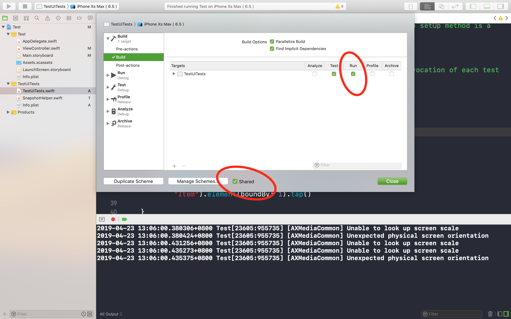
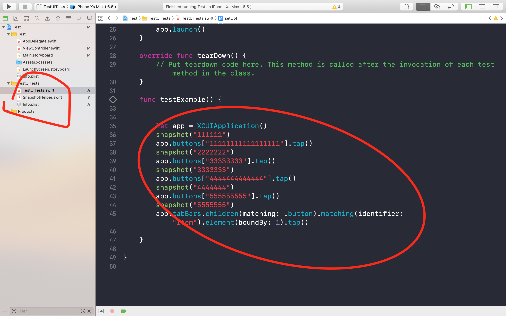
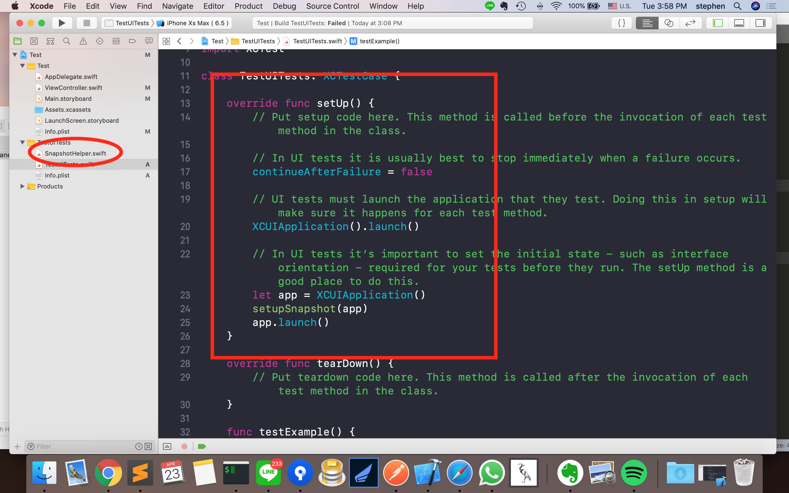
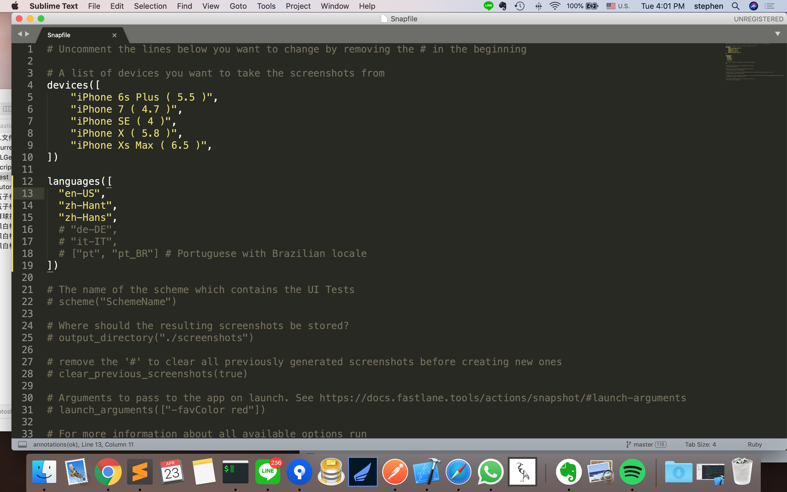
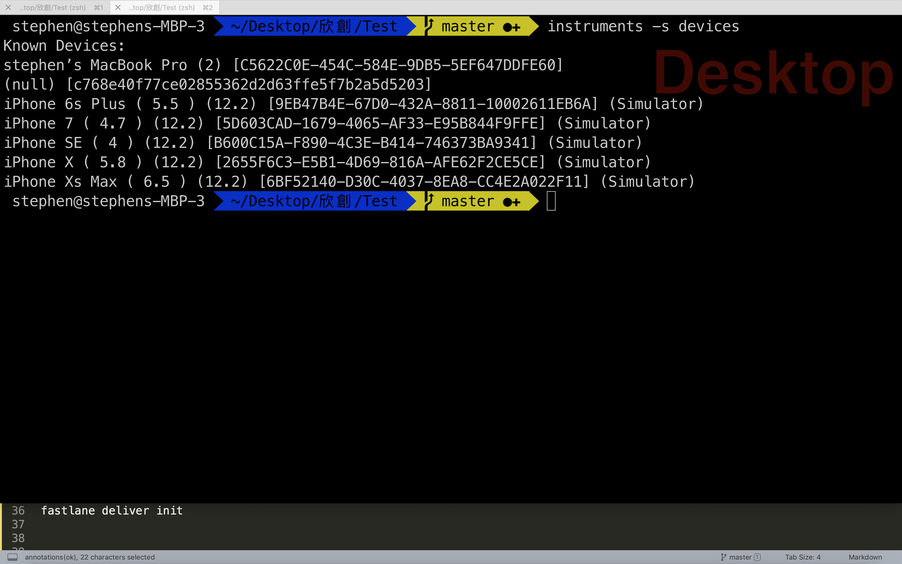
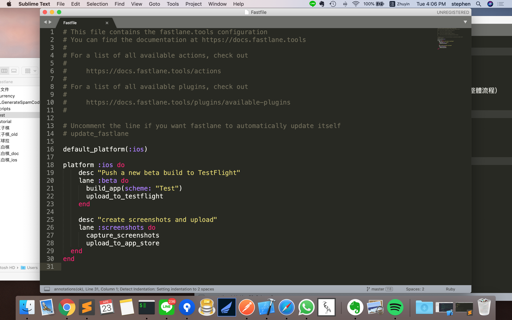
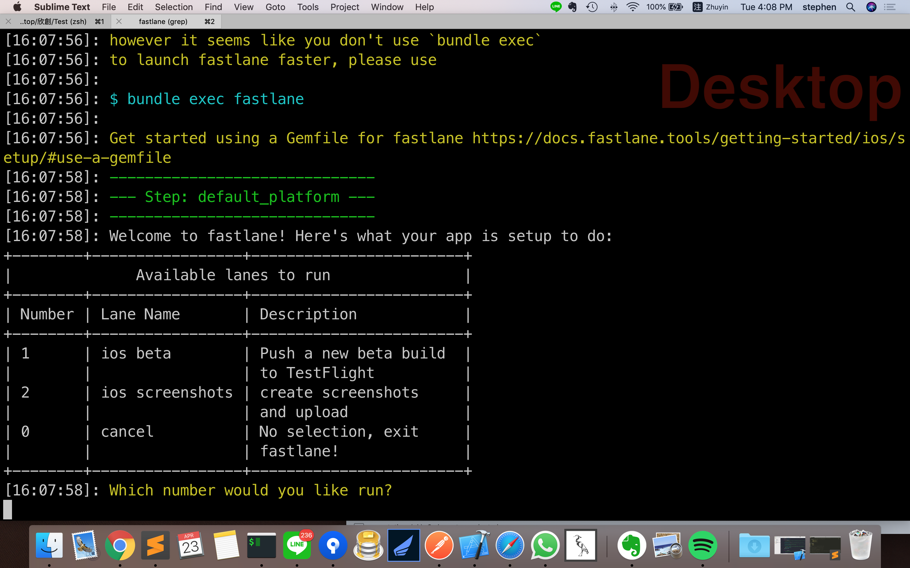
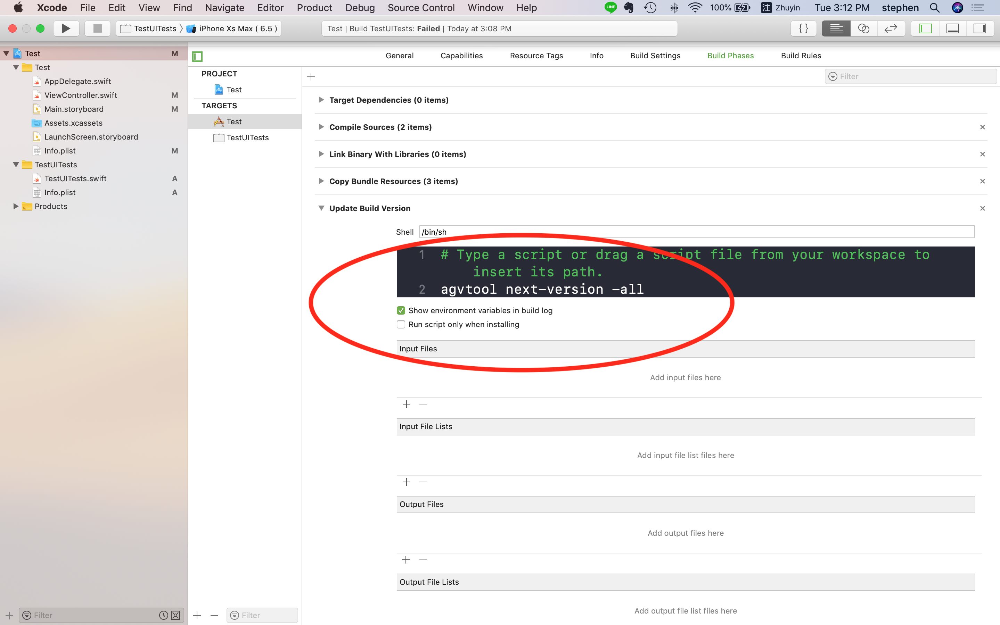
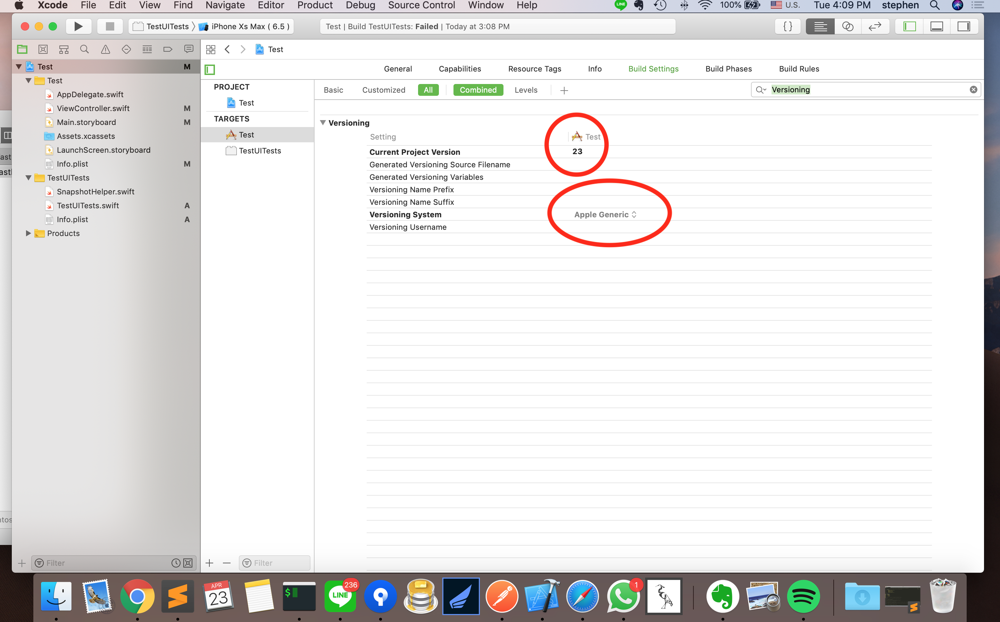

# Tutorial Fastlane

自動增加 build 版本號碼 [Yes]

自動拍照 [Yes]

自動上傳拍照檔案跟 app 相關資訊 [Yes]

自動打包 ipa [No]

# 第一部分 - 安裝 Fastlane ( 有安裝過跳到第二步驟 )

```bash
brew cask install fastlane
```

# 第二部分 - 建立好 UITest

* 配置 Scheme



* 撰寫 UITest



# 第三部分 - Fastlane 前置配置

```bash
fastlane init
```

# 第四部分 - Snapshot 自動拍照 前置配置

```bash
fastlane snapshot init
```

* 把 ./SnapshotHelper.swift 加到 unittest 裡面，左邊導航列



```swift
let app = XCUIApplication()
        setupSnapshot(app)
        app.launch()

```

* 修正參數檔 Snapfile



* 比較需要注意的第方是語系還有幾種，可以透過下面指令拿到所有的機型

```bash
instruments -s devices
```



* 執行 snapshot （這部分指示單純執行拍照，第六部分會透過 Fastfile 統一執行整體流程）

```bash
fastlane snapshot
```

# 第五部分 - deliver 自動更新上架資訊 配置

```bash
fastlane deliver
```

# 第六部分 - 設置整體流程 Fastfile



```ruby
lane :screenshots do
  capture_screenshots
  upload_to_app_store
end
```

* 執行 fastlane 



# 第七部分 - 自動增加版本號

[自動增加版本號 source ](https://developer.apple.com/library/archive/qa/qa1827/_index.html)

到 Build setting 裡面



到 Build phase 裡面




