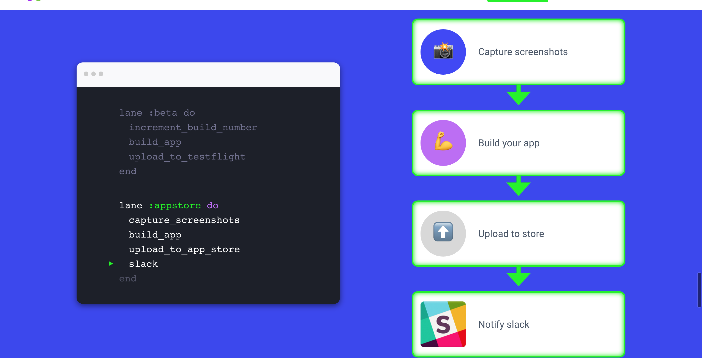

# Tutorial Fastlane



* 自動增加 build 版本號碼 ✅

* 動拍照 ✅

* 動上傳拍照檔案跟 app 相關資訊 ✅

* 動打包 ipa

# 第一部分 - 安裝 Fastlane ( 有安裝過跳到第二步驟 )

```bash
brew cask install fastlane
```

# 第二部分 - 自動增加版本號

[自動增加版本號 source ](https://developer.apple.com/library/archive/qa/qa1827/_index.html)

* 到 Build setting 裡面


* 到 Build phase 裡面


# 第三部分 - UITest

### 配置 Scheme


-------

### 撰寫 UITest


-------

# 第四部分 - Fastlane 前置配置

```bash
fastlane init
```

# 第五部分 - 配置 Snapshot (自動拍照)

### 安裝

```bash
fastlane snapshot init
```

### 安裝後，把 ./SnapshotHelper.swift 加到 unittest 裡面，注意左邊導航列還有把下面的 code 貼到 setup()

```swift
let app = XCUIApplication()
        setupSnapshot(app)
        app.launch()

```


-------

### 修正參數檔 Snapfile

* 注意：比較需要注意的第方是語系還有 Devices，可以透過下面指令拿到所有的機型。
* 注意：目前app store 上面建議只有 6.5 跟 5.5 即可，所以可不用像我上面這麼多 device。

```bash
instruments -s devices
```


-------

### 執行 Snapshot 

* 注意：這部分指示單純執行拍照，第六部分會透過 Fastfile 統一執行整體流程

```bash
fastlane snapshot
```

# 第六部分 - 配置 Deliver (自動上傳上架資訊)

```bash
fastlane deliver
```

# 第七部分 - 設置 Fastfile (把流程串起來)


```ruby
lane :screenshots do
  capture_screenshots
  upload_to_app_store
end
```


-------

### 執行 fastlane 


